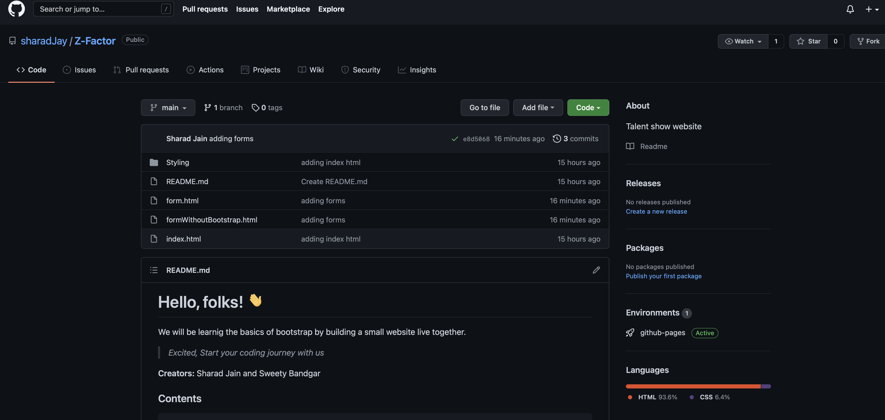
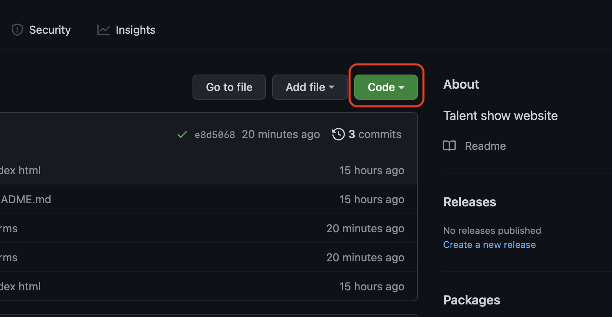
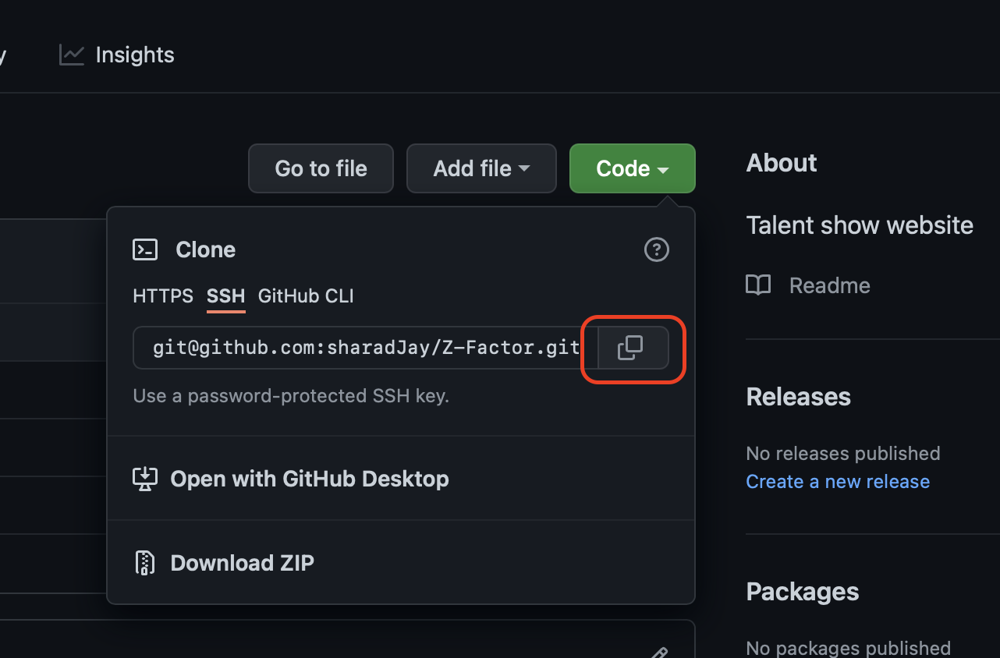
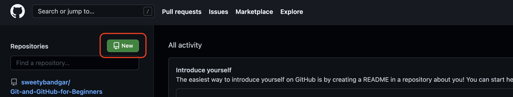
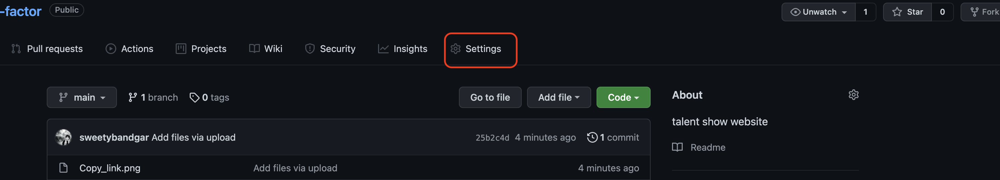
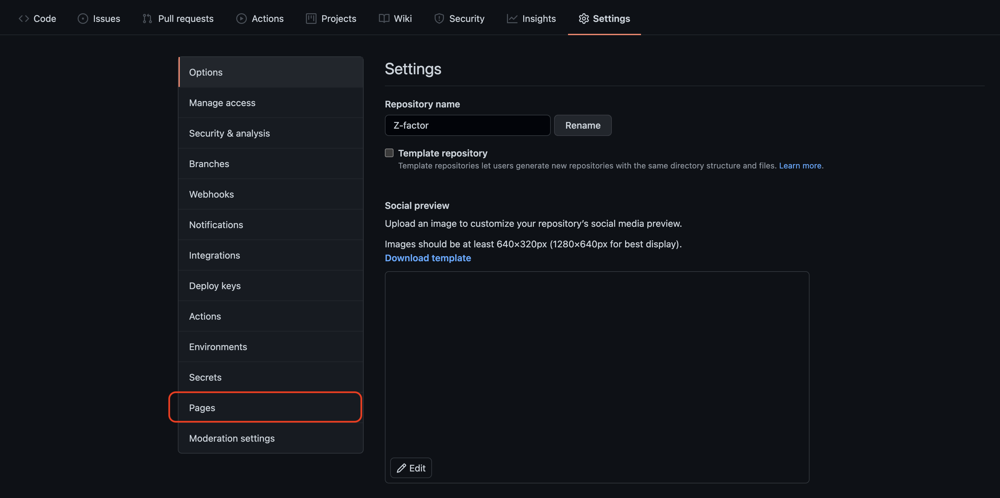
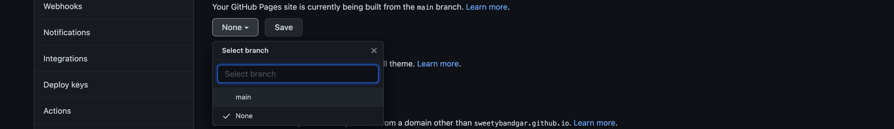
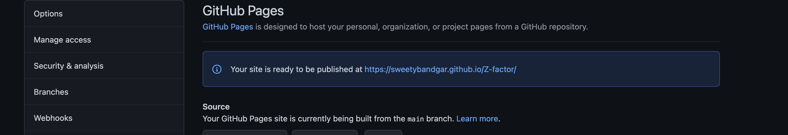
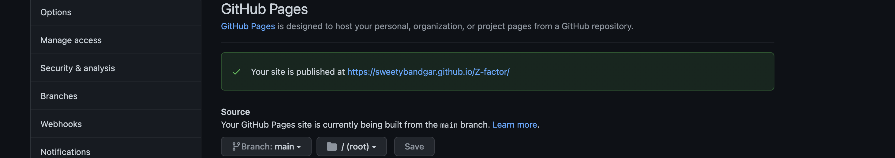

# Hello, folks! 

We will be learning the basics of bootstrap by building a [small website](https://sharadjay.github.io/Z-Factor/index.html) live together.
>*Excited, Start your coding journey with us*  

**Creators:** Sharad Jain and Sweety Bandgar

## Contents  
    1. What is Bootstrap?
    2. How to install it?
    3. Clone the Repository
    4. Bring Website online
    
## 1. What is Bootstrap? 
Bootstrap is the most popular HTML, CSS, and JS framework for developing responsive, mobile first projects on the web.
It is designed for everyone, everywhere. Bootstrap makes front-end web development faster and easier. It's made for folks of all skill levels, devices of all shapes, and projects of all sizes. If you want more details, use [this link](https://getbootstrap.com/docs/5.1/getting-started/introduction/)

## 2. How to install it? 
We won't be downloading anything, instead we will use jdDelivr, a free open source Content delivery network ([CDN](https://en.wikipedia.org/wiki/Content_delivery_network)) to load the bootstrap libraries.

**Action:** *Copy-paste the below stylesheet link tag into your head tag section before all other stylesheets to load our CSS*

    <link href="https://cdn.jsdelivr.net/npm/bootstrap@5.1.1/dist/css/bootstrap.min.css" rel="stylesheet" integrity="sha384-F3w7mX95PdgyTmZZMECAngseQB83DfGTowi0iMjiWaeVhAn4FJkqJByhZMI3AhiU" crossorigin="anonymous">
    
## 3. Clone the repository 
Follow the below steps: 

1. Go to [Repository's main](https://github.com/sharadJay/Z-Factor) page on github.  
2. Above the list of files, click  Code green button.  
3. Copy the link.  
4. Open Terminal. 
5. Change the current working directory to the location where you want the cloned directory. 
6. Type git clone, and then paste the URL you copied earlier. 
```
$ git clone git@github.com:sharadJay/Z-Factor.git
```  
7. Press Enter to create your local clone.
```
$ git clone git@github.com:sharadJay/Z-Factor.git
>Cloning into 'Z-Factor'...
>remote: Enumerating objects: 13, done.
>remote: Counting objects: 100% (13/13), done.
>remote: Compressing objects: 100% (9/9), done.
>Receiving objects: 100% (13/13), 4.32 KiB | 4.32 MiB/s, done.
>Resolving deltas: 100% (3/3), done.
>remote: Total 13 (delta 3), reused 9 (delta 2), pack-reused 0
```
For more details, [cick here.](https://docs.github.com/en/repositories/creating-and-managing-repositories/cloning-a-repository)

## 4. Bring website online
1. Go to github and sign in 
2. Click on new 
3. Write website name in repository name place holder and give a description
4. Select Public 
5. Click on create repository 
6. Go to github and open your repository
7. CLick on settings 
8. go to pages 
9. select main and save 
10. refresh the page 
11. Click on the highlighted link, Vola! 
